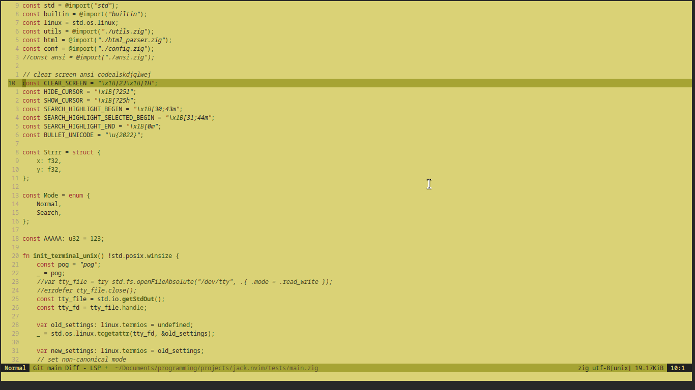
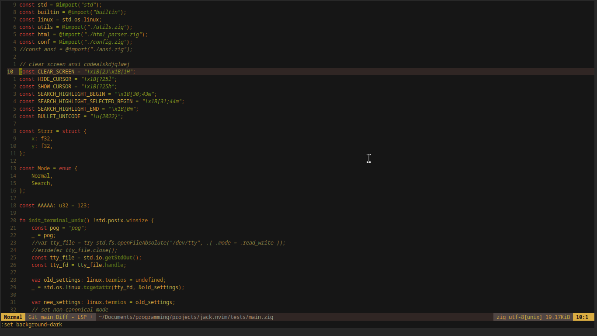

# Introduction
A Basic Nvim color scheme with little blue color to
further my quest of purging blue light of my software

## light


## dark


# Installation
## Lazy.nvim
```
require('lazy').setup({
    {
      'lintusm/jack.nvim',
      priority = 1000,
    },
})
```
# Usage
```
-- set color scheme
vim.o.colorscheme = 'jack'
-- set background
vim.o.background = 'dark'
```
# Notes
For for suckless terminal(st) users,
the mouse color must be changed manually
in st's configuration
